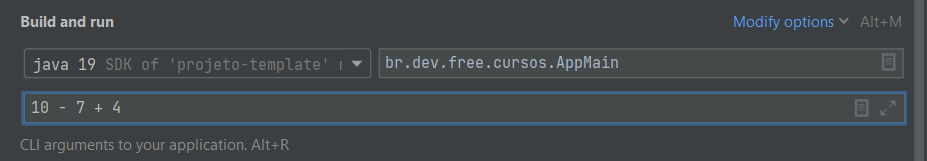

# Calculadora na linha de comando (JAVA)

### Descrição

Uma calculadora que suporta entradas como:

* `1`
* `1 + 5`
* `10 - 7 + 4`
* `24 + 1 - 2 / 4`
* `95 * 2 - 1 + 5 / 3`

e retorna o resultado se a entrada for valida, ou mensagem `Entrada invalida`.

Tambem tera que gravar todas operações feitas num arquivo `historico.txt`

Entrada principal é AppMain.java -> main() e utilize argumentos para passar a expressão matemática.

